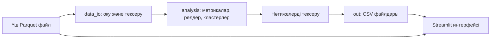

# Ақша графы — HackAlem AI

Банк AML-аналитигіне арналған қаржы желісін зерттеу құралы. Бағытталған
аударымдар графынан клиенттердің ықтимал рөлдерін, кластерлерін және тексеру
басымдығын есептейді. Қорытындылар — тексеруге арналған гипотезалар, кінә туралы
тұжырым емес.

## Не іске асырылды

- Parquet файлдарын оқу, жұптар/сомалар/транзакция санының сәйкестігін тексеру.
- Барлық клиентті, соның ішінде оқшауланғандарын қамтитын бағытталған граф.
- Алты түсіндірілетін рөл, 0–1 бағалары және сандық негіздеме.
- Louvain кластеризациясы, кластер сипаттамалары және басымдық бойынша топ-20.
- Қазақша интерфейс: gid іздеу, клиент карточкасы, бағытталған граф,
  рөл/кластер сүзгілері және үш міндетті CSV жүктеу.
- Төртінші қадамдағы дерек шекарасын және seed кірісінің толық еместігін ескеру.

## Архитектура және жұмыс тәртібі



`pipeline.py` толық есептеуді басқарады. `src/analysis.py` төрт DataFrame
қайтарады, `src/data_io.py` оларды сақтайды. `app.py` нәтижелерді оқиды,
`ui/graph_view.py` графты көрсетеді. Интерфейс рөлдерді қайта есептемейді.

## Орнату және іске қосу

Тексерілген орта: Windows, Python 3.12. Репозиторийді көшіріп алғаннан кейін
командаларды жобаның түбірінде орындаңыз. Ұйымдастырушылар берген үш файлды
`data/` қалтасына салыңыз: `edges.parquet`, `nodes.parquet`, `transactions.parquet`.
Бастапқы деректер Git-ке қосылмаған.

```powershell
py -m venv .venv
.\.venv\Scripts\python.exe -m pip install -r requirements.txt
```

Деректерден барлық CSV-ге дейінгі бір команда:

```powershell
.\.venv\Scripts\python.exe -X utf8 pipeline.py --data data --out out
```

Интерфейсті ашу:

```powershell
.\.venv\Scripts\python.exe -m streamlit run app.py
```

Терминалдағы жергілікті сілтемені ашыңыз. Жаңа есептеуден кейін экрандағы
«Жаңарту» батырмасын басыңыз. Linux/macOS-та сәйкес Python командасы —
`.venv/bin/python`; ортаны `python3 -m venv .venv` арқылы жасауға болады.

## Нәтижелер

| Файл | Бағандар |
|---|---|
| `out/nodes_roles.csv` | gid, role, role_score, cluster_id, priority_score, evidence |
| `out/clusters.csv` | cluster_id, n_nodes, n_seed, sum_kzt_internal, top_gids, hypothesis |
| `out/top_nodes.csv` | rank, gid, role, priority_score, why |
| `out/node_metrics.csv` | gid және қосымша есептелген метрикалар |

Алғашқы үш файл ТЗ бойынша міндетті, төртіншісі тексеру мен талдауға арналған.
`out/` Git-те еленбейді: қазылар файлдарды жоғарыдағы командамен қайта жасай алады;
тапсыру кезінде жасалған CSV файлдарын жеке артефакт ретінде қоса беріңіз.

## Қазыларға тексеру сценарийі

```powershell
.\.venv\Scripts\python.exe -X utf8 checks/check_outputs.py --data data --out out
.\.venv\Scripts\python.exe -m unittest src.test_analysis checks.test_interface -v
```

1. Пайплайнды орындап, 2 248 клиенттің нәтижесі және кемінде 20 топ-клиент барын тексеріңіз.
2. Интерфейстің «Тексеру басымдығы» бөлімінен gid көшіріңіз.
3. «Желі және клиент» бөлімінде оны іздеп, рөлін, дәлелін және байланыстарын ашыңыз.
4. depth=4 және шығысы жоқ клиентті ашып, дерек шекарасы туралы ескертуді тексеріңіз.
5. «Жүктеу» бөлімінен үш CSV алыңыз.

Біріктірілген нұсқаны осы компьютерде тексеру: 2 248 клиент, 3 119 байланыс,
4 840 транзакция; 88 кластер және 20 топ-клиент. Толық пайплайн шамамен
1 секундта аяқталды (компьютерге байланысты өзгереді). 12 автоматты тест және
нақты CSV-лердің кіріс деректерімен сәйкестік тексеруі өтті.

## Технологиялар мен әдістеме

Python, pandas, NumPy, PyArrow, NetworkX, SciPy, Streamlit және PyVis қолданылады.
Ақылы API, сыртқы LLM немесе оқытылған AI-модель қосылмаған. Талдау түсіндірілетін
эвристикалық ережелер мен граф алгоритмдеріне негізделген.

Рөлдердің нақты ережелері, басымдық формуласы, шектері мен салмақтары
[аналитика әдістемесінде](docs/methodology.md) берілген. Рөл таңдау тәртібі:
coordinator → consolidator → distributor → transit → terminal → peripheral.
`role_score` калибрленген ықтималдық емес. Бөліктердің қосылу форматы мен
интерфейс параметрлері: [интерфейс нұсқаулығы](docs/interface.md).

## Деректер және шектеулер

Ұйымдастырушылардың обезличенген деректері: 81 seed клиенттен тек шығыс
бағытында төрт қадам; 2026 жылғы шілде; кемінде 5 000 KZT ішкібанк аударымдары.
Сыртқы деректер қосылмайды. Нәтижелер тек осы таңдамаға қатысты.

- depth=4 кезіндегі жоқ шығыс ақшаның клиентте қалғанын дәлелдемейді.
- Seed кірісі толық емес; көрінетін кіріс/шығыс толық шот балансы емес.
- Рөлдердің белгіленген дұрыс жауаптары жоқ; accuracy өлшенбеген.
- Түсіндірмелер аналитика модулінен ағылшын тілінде келеді.
- Граф бастапқыда 250 түйінмен шектеледі; шекті экранда арттыруға болады.
- Пайплайн берілген кейстің жол сандарын қатаң тексереді. Өзге көлемдегі
  дерекке бейімдеу үшін бұл тексеруді өзгерту қажет.
- Интернет орнату кезінде керек; есептеу мен графты көрсету жергілікті жүреді.

Миллион түйінге өскенде: деректерді бөліктермен оқу/SQL агрегация, sparse немесе
igraph негізіндегі есептеу, компоненттер бойынша кластеризация және
betweenness үлгісін азайту қажет. Интерфейске тек таңдалған клиент маңайын беру
керек. Бұл масштабқа арналған іске асыру әзірге жасалмаған.

## Жарияланған нұсқа

Интернетке deployed-нұсқа жоқ. Қосымша жергілікті Streamlit серверінде ашылады.
