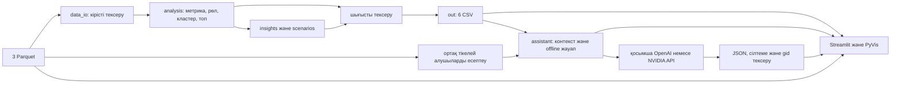

# Ақша графы — KI-AI

## Қысқаша сипаттама

AML-аналитикке транзакциялық желідегі клиенттерді тексеру кезегін түсіндіретін
локал құрал. Қорытындылар — тексеру гипотезалары, адамның кінәсі туралы шешім емес.

## Не іске асырылды

- Бағытталған граф, алты рөл, түсіндірілетін басымдық және Louvain кластерлері.
- Барлық клиентке сандық дәлел, қазақша себептер, шектеулер және келесі қадам.
- Топ-20, 64 салмақ комбинациясындағы рейтинг тұрақтылығы.
- Streamlit/PyVis графы, gid іздеу, сүзгілер, клиент карточкасы, CSV жүктеу.
- Түйінді виртуалды алып тастау сценарийі; бастапқы деректер өзгермейді.
- Бір командалық пайплайн, кіріс/шығыс тексерістері, GitHub Actions.
- API-сіз анықтамалық көмекші: сайттағы «Көмекші» чатында және CLI арқылы нақты
  gid бойынша сақталған дәлелдерден жауап береді, үш CSV дереккөзін көрсетеді.
- Қосымша генеративті ЖИ: OpenAI немесе NVIDIA арқылы клиенттерді түсіндіреді,
  бес клиентке дейін салыстырады; ортақ тікелей алушылар жергілікті есептеледі.
  Жауаптағы сілтемелер және ЖИ-ге берілген нақты деректер экранда көрінеді.

## Шешім қалай жұмыс істейді

Үш Parquet файлын `data/` ішіне салыңыз. Пайплайнды іске қосып, CSV тексеруін
орындаңыз. Интерфейсте топ-20 клиентті қарап, gid арқылы клиентті таңдаңыз;
дәлелді, көршілерді, шектеулерді және келесі қадамды салыстырыңыз.

## Технологиялар

Python 3.12 немесе 3.13, pandas, PyArrow, NumPy, NetworkX, SciPy, Streamlit, PyVis, Requests.
Тікелей тәуелділіктердің нұсқалары `requirements*.txt` файлдарында бекітілген.
Тестілеу: unittest және Streamlit AppTest. CI: GitHub Actions, Ubuntu.
Сыртқы LLM, AI API, GPU немесе ақылы қызмет негізгі есептеуге қажет емес.
`src/assistant.py` жергілікті контекст пен offline жауапты дайындайды;
`src/llm.py` қосылған кезде сыртқы модельге бір HTTP сұрауын жібереді.

## Архитектура



`pipeline.py` компоненттерді шақырады; `src/data_io.py` CSV келісіміне бейімдеп
сақтайды; `checks/check_outputs.py` сәйкестікті тексереді. UI сценарийлері
аналитика функцияларын қолданады. Қазіргі UI толық метрикалардан панельдерді
есептейді; жаңа екі CSV бөлек тапсыру/интеграция келісімі ретінде де сақталады.

## Орнату және іске қосу

PowerShell, Python 3.12 (3.13 орнатылған болса, `-3.12` орнына `-3.13` қолданыңыз):

```powershell
git clone --branch main https://github.com/BAITC-Hacks/hack-842f0aa9-ki-ai.git
cd hack-842f0aa9-ki-ai
py -3.12 -m venv .venv
.\.venv\Scripts\python.exe -m pip install -r requirements.txt
```

Ұйымдастырушы берген `data (1).zip` архивіндегі `data/` қалтасын жобаға көшіріңіз:
`data/nodes.parquet`, `data/edges.parquet`, `data/transactions.parquet`.
Архив атауындағы `(1)` маңызды емес; ішкі файл атаулары дәл сақталсын.

```powershell
.\.venv\Scripts\python.exe -X utf8 pipeline.py --data data --out out
.\.venv\Scripts\python.exe checks/check_outputs.py --out out --data data
.\.venv\Scripts\python.exe -m streamlit run app.py --server.address 127.0.0.1
```

Linux/macOS, Python 3.12:

```bash
python3.12 -m venv .venv
.venv/bin/python -m pip install -r requirements.txt
.venv/bin/python pipeline.py --data data --out out
.venv/bin/python checks/check_outputs.py --out out --data data
.venv/bin/python -m streamlit run app.py --server.address 127.0.0.1
```

Браузер: [localhost:8501](http://localhost:8501). Виртуалды ортаны белсендіру
міндетті емес. Python 3.11 және одан ескі нұсқаларға осы тәуелділіктер арналмаған.
VS Code: Python кеңейтімін орнатып, `Python: Select Interpreter` арқылы `.venv`
ортасын таңдаңыз. Толық орнатуға `requirements.txt` қолданылады.

## Шешімді тексеру

```powershell
.\.venv\Scripts\python.exe -m pip check
.\.venv\Scripts\python.exe -X utf8 -m unittest discover -v
```

Тесттер жеке деректі қолданбайды. `checks/test_delivery.py` синтетикалық
2 248 түйін, 3 119 байланыс, 4 840 транзакциямен толық пайплайнды тексереді;
қате gid, міндетті CSV бұзылыстары және жарамсыз тұрақтылық мәндерін қабылдамауын
тексереді. Екінші толық іске қосуда алты CSV байт бойынша бірдей болуы тексеріледі.
GitHub Actions push/PR кезінде Python 3.12 және 3.13 үшін осы тесттерді іске
қосуға бапталған. Нақты орындалған тексерулер мен hosted CI мәртебесі:
[тексеру есебі](docs/verification.md).

Қазылар сценарийі: пайплайн → тексеруші → сайт → топ-20 ішінен gid таңдау →
карточкадағы себеп пен шектеулерді оқу → виртуалды алып тастау → «Көмекші»
бөліміне сол gid-ті енгізу → жауаптың CSV дереккөздерін салыстыру → CSV жүктеу.
Осы негізгі сценарийге API кілті, ChatGPT жазылымы немесе сыртқы ЖИ аккаунты қажет емес.
Толық есептеу 300 секундтан асса, пайплайн қате кодын қайтарады.

## Деректер және нәтижелер

Кіріс: ұйымдастырушылар берген жеке тұлғамен байланыстырылмаған банк ішіндегі аударымдар,
81 seed, шілде 2026, тек шығыс бағытында төрт қадам, минимум 5 000 ₸.
Нақты деректер мен нәтижелер Git-ке кірмейді. Қосымша ЖИ режимінде ғана
пайдаланушы таңдаған OpenAI немесе NVIDIA сервисіне шектелген контекст жіберіледі.

| Файл | Міндетті бағандар |
|---|---|
| nodes_roles.csv | gid, role, role_score, cluster_id, priority_score, evidence |
| clusters.csv | cluster_id, n_nodes, n_seed, sum_kzt_internal, top_gids, hypothesis |
| top_nodes.csv | rank, gid, role, priority_score, why |
| node_metrics.csv | gid және аналитика метрикалары |
| node_insights.csv | gid, reasons, limitations, next_step |
| ranking_stability.csv | gid, runs, top20_count, rank_min, rank_max |

Алғашқы үш CSV — ТЗ-дағы міндетті нәтиже, қалған үшеуі — метрикалар мен
қосымша талдау. Пайплайн оларды бір іске қосуда сақтайды және тексереді.
Сайт осы алты CSV-ді жүктетеді; `sensitivity_scenarios.csv` салмақ нұсқаларын
қосымша береді. Түйінді алып тастау тек батырма басылғанда есептеледі.

`runs=64`, baseline есепке кірмейді; `top20_count` — клиент топ-20 ішінде қалған
сынақ саны. Бұл кінә ықтималдығы емес. Барлық кестелер gid арқылы қосылады.
gid — int64; JavaScript-та көрсеткенде дәлдікті сақтау үшін жолға айналдыру керек.

Рөлдер: coordinator → consolidator → distributor → transit → terminal;
бірінші сәйкес ереже алынады, қалғандары peripheral. Transit үшін шығыс/кіріс
0.7–1.3 және уақыттық үлес кемінде 0.5; terminal үшін шығыс/кіріс ≤0.1.
Seed пен төртінші қадамда қиылған түйіндер бұл баланс ережелерінен шығарылған.
Барлық шектер, нормалау және формулалар: [әдістеме](docs/methodology.md).

## ЖИ көмекшісін қосу

1. Негізгі пайплайнды іске қосып, сайттағы **Көмекші → ЖИ-ді қосу: API баптаулары** бөлімін ашыңыз.
2. **OpenAI** немесе **NVIDIA** таңдаңыз. Сол провайдердің API кілтін жасырын өріске енгізіңіз.
3. **ЖИ режимін қосу** тетігін қосып, сұрақ жазыңыз. Кілт пен модельге қолжетімділік алғашқы сұрақта тексеріледі.
4. «ЖИ жауабы» белгісін, `[N1]` / `[G1]` дереккөздерін және **ЖИ қолданған нақты деректер** бөлімін салыстырыңыз.

Әдепкі модельдер: OpenAI `gpt-4.1-mini-2025-04-14`, NVIDIA
`meta/llama-3.3-70b-instruct`. API кілті тиісті провайдерге тиесілі болуы керек;
модель өрісіне үйлесімді, аккаунтыңызға қолжетімді модель атауын беруге болады.
Интеграция [OpenAI Responses structured outputs](https://developers.openai.com/api/docs/guides/structured-outputs)
және [NVIDIA Chat Completions](https://docs.api.nvidia.com/nim/reference/meta-llama-3_3-70b-instruct-infer)
пішімдерін қолданады. Бұл агенттік цикл емес: жергілікті есептеу және бір LLM шақыруы.

Мысал сұрақтар:

- `100000003016635100 клиентін неге тексеру керек? Шектеулер мен келесі қадамды түсіндір.`
- Нақты екі gid жазып: `... мен ... көрсеткіштерін салыстыр. Ортақ тікелей алушылары бар ма?`
- Клиент таңдалмаса: `Басымдығы жоғары клиенттер туралы түсіндір.` Бұл сұраққа тек алғашқы бес клиент беріледі.

Сұрақтағы gid таңдалған клиенттен басым. Бір сұраққа ең көбі бес клиент карточкасы
және барлық таңдалған клиентке ортақ тікелей алушылардың ең көбі он жолы беріледі.
Сомалар мен аударым саны `edges.parquet` бойынша Python-да есептеледі. Толық
Parquet файлдары жіберілмейді. Жоқ gid немесе жарамсыз CSV болса API шақырылмайды.
Қосылу, кредит, уақыт немесе жауап пішімі қатесі кезінде себебі көрсетіліп,
бірінші клиенттің жергілікті карточкасы қайтарылады; ол ЖИ жауабы деп белгіленбейді.

Жасырын өрістегі кілт файлға жазылмайды: ол ағымдағы сессия жадында ғана болады.
Сайтты қайта ашқанда оны қайта енгізу қажет болуы мүмкін. **Енгізілген кілттерді өшіру**
батырмасы сессиядағы кілттерді өшіріп, ЖИ режимін сөндіреді. Серверде алдын ала
берілген `OPENAI_API_KEY` / `NVIDIA_API_KEY` орта айнымалылары да қолданылады.
Балама: `.streamlit/secrets.toml.example` үлгісін `.streamlit/secrets.toml` етіп
көшіріп, кілтті тек жергілікті файлда толтырыңыз; бұл файл Git-тен шығарылған.
`.env` автоматты оқылмайды. Кілтті чатқа, README-ге немесе GitHub-қа қоспаңыз.

CLI, кілт орта айнымалысы арқылы берілгенде:

```powershell
.\.venv\Scripts\python.exe -X utf8 -m src.assistant "100000003016635100 неге тексеру керек?" --out out --data data --ai OpenAI
```

API кілтінсіз жергілікті анықтама:

```powershell
.\.venv\Scripts\python.exe -X utf8 -m src.assistant "100000005933757100 туралы айт" --out out
```

Қосылу келісімі: `from src.assistant import answer_question`; нәтиже — `mode`,
`status`, `gid` (анықталса), `answer`, `sources` сөздігі. `status=ok` кезінде
жауапта үш CSV атауы мен gid көрсетіледі. Басқа мәртебелер: `invalid_question`,
`not_found`, `unavailable`, `invalid_data`; мұндай жауапта дереккөз жоқ.
CLI сәтті жауапта exit code 0, қалған жағдайда 1 қайтарады.

`answer_with_ai(..., config=AIConfig(...))` сәтті жауапта `mode=llm`, `status=ok`,
`provider`, `model`, `answer`, `sources`, `evidence` қайтарады. API қатесінде
`mode=offline`, `status=fallback`, `notice` қайтарылады; CLI exit code 1 береді.

Сайттағы «Көмекші» соңғы 10 сұрақты ағымдағы браузер сессиясында сақтайды;
«Сөйлесуді тазарту» батырмасы тарихты өшіреді. CSV жаңарғанда ескі жауаптар
тазаланады. Әр сұрақ бөлек өңделеді: алдыңғы диалог модельге жіберілмейді.
API-сіз режимде бір сұрақта бір толық gid қажет және дайын карточка қайтарылады.

Сыртқы ЖИ режимін осы деректерді тиісті провайдерге беруге рұқсатыңыз болғанда
ғана қосыңыз. OpenAI сұрауында `store=false` берілген; бұл провайдердің барлық
сақтау саясаттарын алмастырмайды. Негізгі пайплайн мен offline режим сыртқы API қолданбайды.

## Шектеулер және масштабтау

Ground truth жоқ; accuracy немесе кінә ықтималдығы есептелмейді. Төртінші қадам
соңы шынайы ақша тоқтауы емес; seed кірісі толық емес; шот қалдықтары жоқ.
ЖИ түсіндірмесі қателесуі мүмкін: JSON пішімі, сілтемелер мен жаңа үлкен gid
тексеріледі, бірақ әр сөйлемнің мағынасы мен барлық санның дұрыстығына кепіл жоқ.
Нақты контекст экранда салыстыру үшін беріледі. Еркін SQL/Python орындау,
көп қадамды агент және кез келген ұзындықтағы ақша жолын іздеу қосылмаған.
Кітапханалар кейбір deprecation ескертулерін береді, олар тест қателері емес.
Алғаш орнатуға интернет керек. PyVis графының JavaScript және CSS ресурстары
HTML ішіне енгізілген; графқа сыртқы CDN қажет емес. 1 млн түйінде Parquet partition/Polars, igraph,
жуық орталықтық, фондық есеп және сұранысқа сай шағын граф көрсету қажет;
мұндай масштаб бұл нұсқада тексерілмеген.

## Тапсыру

Қазылар GitHub арқылы тексереді: осы код, README, архитектура сызбасы,
әдістеме және қайталанатын тесттер репозиторийде бар. Ұйымдастырушының бастапқы
үш Parquet файлын алған соң README командалары барлық нәтижені қайта жасайды.
Тапсыру және орнату үшін ортақ `main` тармағын қолданыңыз. Жаңа өзгерістерді
жеке тармақта дайындап, PR арқылы біріктіріңіз; файлдарды қолмен көшірмеңіз.

Алты нәтиже `out/` ішінде дайындалады. Қажет болса, оларды жергілікті архивке жинаңыз:

```powershell
Compress-Archive -Path out/nodes_roles.csv,out/clusters.csv,out/top_nodes.csv,out/node_metrics.csv,out/node_insights.csv,out/ranking_stability.csv -DestinationPath out/submission.zip -Force
```

Бұл команда архивті ешқайда жібермейді. Нақты деректер мен CSV нәтижелері
Git-ке және Actions-қа кірмейді. Оларды тек хакатонға рұқсат етілген арнамен
беру қажет. Қорғау презентациясы осы тапсыру сценарийіне кірмейді.

## Deployed-нұсқа

Қоғамдық deployment жоқ. Қолданба локал [localhost:8501](http://localhost:8501)
адресінде іске қосылады; бұл сілтеме басқа компьютерден сіздің сайтыңызды ашпайды.
