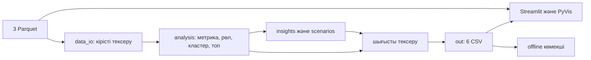

# Ақша графы — KI-AI

## Қысқаша сипаттама

AML-аналитикке транзакциялық желідегі клиенттерді тексеру кезегін түсіндіретін
локал құрал. Қорытындылар — тексеру гипотезалары, адамның кінәсі туралы шешім емес.

## Не іске асырылды

- Бағытталған граф, алты рөл, түсіндірілетін басымдық және Louvain кластерлері.
- Барлық клиентке сандық дәлел, қазақша себептер, шектеулер және келесі қадам.
- Топ-20, 64 салмақ комбинациясындағы рейтинг тұрақтылығы.
- Streamlit/PyVis графы, gid іздеу, сүзгілер, клиент карточкасы, CSV жүктеу.
- Түйінді виртуалды алып тастау сценарийі; бастапқы деректер өзгермейді.
- Бір командалық пайплайн, кіріс/шығыс тексерістері, GitHub Actions.
- API-сіз анықтамалық көмекші: нақты gid бойынша сақталған дәлелдерден жауап береді.

## Шешім қалай жұмыс істейді

Үш Parquet файлын `data/` ішіне салыңыз. Пайплайнды іске қосып, CSV тексеруін
орындаңыз. Интерфейсте топ-20 клиентті қарап, gid арқылы клиентті таңдаңыз;
дәлелді, көршілерді, шектеулерді және келесі қадамды салыстырыңыз.

## Технологиялар

Python 3.13, pandas, PyArrow, NumPy, NetworkX, SciPy, Streamlit, PyVis.
Тестілеу: unittest және Streamlit AppTest. CI: GitHub Actions, Ubuntu.
Сыртқы LLM, AI API, GPU немесе ақылы қызмет негізгі есептеуге қажет емес.
`src/assistant.py` — детерминистік offline көмекші; генеративті ЖИ моделі емес.

## Архитектура



`pipeline.py` компоненттерді шақырады; `src/data_io.py` CSV келісіміне бейімдеп
сақтайды; `checks/check_outputs.py` сәйкестікті тексереді. UI сценарийлері
аналитика функцияларын қолданады. Қазіргі UI толық метрикалардан панельдерді
есептейді; жаңа екі CSV бөлек тапсыру/интеграция келісімі ретінде де сақталады.

## Орнату және іске қосу

PowerShell, Python 3.13:

```powershell
git clone --branch codex/delivery-upgrade https://github.com/BAITC-Hacks/hack-842f0aa9-ki-ai.git
cd hack-842f0aa9-ki-ai
py -3.13 -m venv .venv
.\.venv\Scripts\python.exe -m pip install -r requirements.txt
```

Ұйымдастырушы берген `data (1).zip` архивіндегі `data/` қалтасын жобаға көшіріңіз:
`data/nodes.parquet`, `data/edges.parquet`, `data/transactions.parquet`.
Архив атауындағы `(1)` маңызды емес; ішкі файл атаулары дәл сақталсын.

```powershell
.\.venv\Scripts\python.exe -X utf8 pipeline.py --data data --out out
.\.venv\Scripts\python.exe checks/check_outputs.py --out out --data data
.\.venv\Scripts\python.exe -m streamlit run app.py --server.address 127.0.0.1
```

Linux: `python3.13 -m venv .venv`, кейін `.venv/bin/python` қолданыңыз.
Браузер: http://localhost:8501. Виртуалды ортаны белсендіру міндетті емес.

## Шешімді тексеру

```powershell
.\.venv\Scripts\python.exe -m pip check
.\.venv\Scripts\python.exe -X utf8 -m unittest discover -v
```

Тесттер жеке деректі қолданбайды. `checks/test_delivery.py` синтетикалық
2 248 түйін, 3 119 байланыс, 4 840 транзакциямен толық пайплайнды тексереді;
қате gid және жарамсыз тұрақтылық мәндерін қабылдамауын тексереді.
GitHub Actions push/PR кезінде осы тесттерді орындайды.

Қазылар сценарийі: пайплайн → тексеруші → сайт → топ-20 ішінен gid таңдау →
карточкадағы себеп пен шектеулерді оқу → виртуалды алып тастау → CSV жүктеу.
Толық есептеу 300 секундтан асса, пайплайн қате кодын қайтарады.

## Деректер және нәтижелер

Кіріс: ұйымдастырушылар берген обезличенный ішінде-банктік аударымдар,
81 seed, шілде 2026, тек шығыс бағытында төрт қадам, минимум 5 000 ₸.
Нақты деректер мен нәтижелер Git-ке кірмейді. Сыртқы интеграция жоқ.

| Файл | Міндетті бағандар |
|---|---|
| nodes_roles.csv | gid, role, role_score, cluster_id, priority_score, evidence |
| clusters.csv | cluster_id, n_nodes, n_seed, sum_kzt_internal, top_gids, hypothesis |
| top_nodes.csv | rank, gid, role, priority_score, why |
| node_metrics.csv | gid және аналитика метрикалары |
| node_insights.csv | gid, reasons, limitations, next_step |
| ranking_stability.csv | gid, runs, top20_count, rank_min, rank_max |

`runs=64`, baseline есепке кірмейді; `top20_count` — клиент топ-20 ішінде қалған
сынақ саны. Бұл кінә ықтималдығы емес. Барлық кестелер gid арқылы қосылады.
gid — int64; JavaScript-та көрсеткенде дәлдікті сақтау үшін жолға айналдыру керек.

Рөлдер: coordinator → consolidator → distributor → transit → terminal;
бірінші сәйкес ереже алынады, қалғандары peripheral. Transit үшін шығыс/кіріс
0.7–1.3 және уақыттық үлес кемінде 0.5; terminal үшін шығыс/кіріс ≤0.1.
Seed пен төртінші қадамда қиылған түйіндер бұл баланс ережелерінен шығарылған.
Барлық шектер, нормалау және формулалар: [әдістеме](docs/methodology.md).

## Offline көмекші және сыртқы ЖИ

```powershell
.\.venv\Scripts\python.exe -X utf8 -m src.assistant "100000005933757100 туралы айт" --out out
```

UI авторына: `from src.assistant import answer_question`; нәтиже — `mode`,
`gid` (табылса), `answer`, `sources` сөздігі. Көмекші әр жауапта CSV атауы мен
gid-ті көрсетеді. Қолдаусыз сұрақта gid сұрайды; ойдан жауап құрмайды.
Көмекшіге жеке UI панелі әлі қосылмаған.

Сыртқы LLM-ге дерек жіберілмейді. ТЗ сыртқы API қолдану мүмкіндігін атайды,
бірақ нақты провайдерге транзакцияларды беруге жеке рұқсатты растамайды.
Сыртқы ЖИ енгізу алдында ұйымдастырушының дерек беру рұқсатын тексеру қажет.
API кілттерін `.env`/secrets ішінде ғана сақтаңыз; Git-ке қоспаңыз.

## Шектеулер және масштабтау

Ground truth жоқ; accuracy немесе кінә ықтималдығы есептелмейді. Төртінші қадам
соңы шынайы ақша тоқтауы емес; seed кірісі толық емес; шот қалдықтары жоқ.
Кітапханалар кейбір deprecation ескертулерін береді, олар тест қателері емес.
Алғаш орнатуға интернет керек; PyVis тәуелді сыртқы браузер ресурстарын
демо алдында тексеріңіз. 1 млн түйінде Parquet partition/Polars, igraph,
жуық орталықтық, фондық есеп және сұранысқа сай шағын граф көрсету қажет;
мұндай масштаб бұл нұсқада тексерілмеген.

## Тапсыру

Репозиторий + README + архитектура сызбасы + `out/` ішіндегі алты CSV +
5 минуттық демо. CSV-лерді ұйымдастырушының рұқсат етілген арнасымен беріңіз.
Ешбір дерек файлы Actions-қа жүктелмейді. Нақты тест нәтижелері PR сипаттамасында.

## Deployed-нұсқа

Қоғамдық deployment жоқ. Қолданба локал http://localhost:8501 адресінде іске қосылады.
